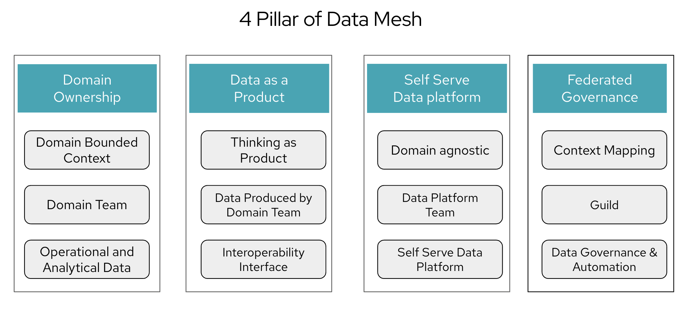
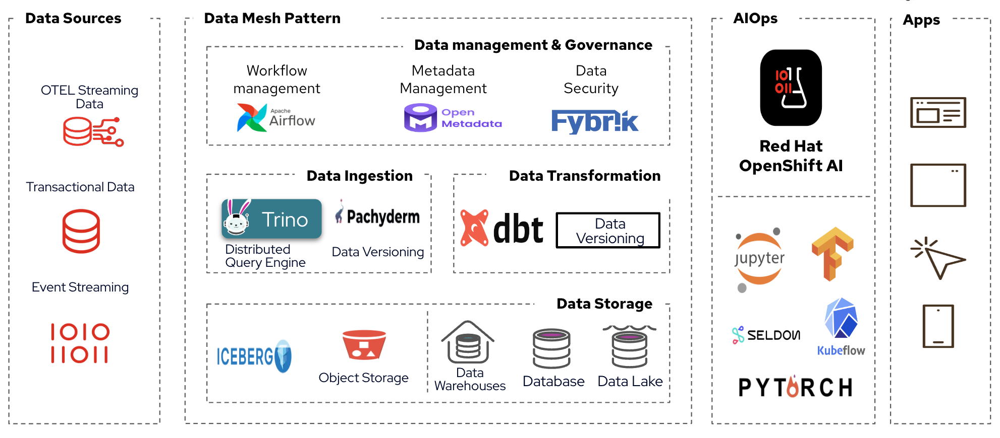

# Data Mesh Pattern

This repository is a mono-repository that provides a community pattern of distributed data mesh architecture based on open source components. As a prerequisite, we recommended reading the following foundational articles to understand the concept and approach towards building a data mesh:

The community pattern implementation is based on 4 foundational principles:

1. **Domain Ownership:** The domain ownership principle mandates the domain teams to take responsibility for their data. According to this principle, analytical data should be composed around domains, similar to the team boundaries aligning with the system’s bounded context. Following the domain-driven distributed architecture, analytical and operational data ownership is moved to the domain teams, away from the central data team.

2. **Data-as-Code:** In a data mesh architecture pattern, data ownership is decentralized and domain data product owners are responsible for all capabilities within a given domain, including discoverability, understandability, quality and security of the data. In effect this is achieved by having agile, autonomous, distributed teams building data pipelines as code and data product interfaces on standard tooling and shared infrastructure services. These teams own the code for data pipelines loading, transforming and serving the data as well as the related metadata, and drive the development cycle for their own data domains. In the process, data handling logic is always treated as code, leveraging the same practices we apply to software code versioning and management to manage changes to data and metadata pipelines.The data as a product principle projects a product thinking philosophy onto analytical data. This principle means that there are consumers for the data beyond the domain. The domain team is responsible for satisfying the needs of other domains by providing high-quality data. Basically, domain data should be treated as any other public API.

3. **Self-service data infrastructure as a platform:** The idea behind the self-serve data infrastructure platform is to adopt platform thinking to data infrastructure. A dedicated data platform team provides domain-agnostic functionality, tools, and systems to build, execute, and maintain interoperable data products for all domains. With its platform, the data platform team enables domain teams to seamlessly consume and create data products.

4. **Federated governance:** The platform requires a layer providing a federated view of the data domains while being able to support the establishment of common operating standards around data / metadata / data lineage management, quality assurance, security and compliance policies, and by extension any cross-cutting supervision concern across all data products. The federated governance principle achieves interoperability of all data products through standardization, which is promoted through the whole data mesh by the governance group. 

The platform is deployed on top of OpenShift Container Platform based on the following component architecture:

The list of open source components integrated into the pattern and their respective role is summarized below.

| Component | Description |
| --------- | ----------- |
| Object Storage ([Ceph)][4]]| Responsible for secure storage of raw data and object-level data access for data ingestion / loading. This is a system layer where data transactions are system-based, considered to be privileged activity and typically handled via automated processes. The data security at this layer is to be governed through secure code management validating the logic of the intended data transaction and secret management to authenticate all access requests for privileged credentials and then enforce data security policies. |
| Data Serving ([Apache Iceberg][5]) | Open standard, high-performance table format responsible for managing the availability, integrity and consistency of data transactions and data schema for huge analytic datasets. This includes the management of schema evolution (supporting add, drop, update, rename), transparent management of hidden partitioning / partitioning layout for data objects, support of ACID data transactions (particularly multiple concurrent writer processes) through eventually-consistent cloud-object stores, and time travel / version rollback for data. This layer is critical to our data-as-code approach as it enables reproducible queries based on any past table snapshot as well as examination of historical data changes. |
| Distributed SQL Query Engine ([Trino][6]) | Centralized data access and analytics layer with query federation capability. This component ensures that authentication and data access query management is standardized and centralized for all data clients consuming data, by providing management capabilities for role-based access control at the data element level in Data Commons. This being a federation layer it can support query across multiple external distributed data sources for cross-querying requirements. |
|Data Versioning and Lineage Management ([Pachyderm][7]) | Automate data transformations with data versioning and lineage. This component helps us provide an immutable lineage with data versioning of any data type, for data being processed in pipelines. It is data-agnostic, supporting both unstructured data such as documents, video and images as well as tabular data from data warehouses. It can automatically detect changes to data, trigger data processing pipelines on change, and ensure both source and processed data are version controlled. |
| Data Transformation ([DBT][8]) | SQL-first transformation workflow tooling that lets teams quickly and collaboratively deploy analytics code following software engineering best practices like modularity, portability, CI/CD, and documentation for data pipelines. This component supports our Data-as-Code approach by providing Git-enabled version control which enables full traceability of code related to data changes and allows a return to previous states. It also supports programmatic and repeatable data validation as it allows automating data pipeline testing, and sharing dynamically generated documentation with all data stakeholders, including dependency graphs and dynamic data dictionaries to promote trust and transparency for data consumers. |
| Data Validation ([Great Expectations][9]) | Open-source library for validating, documenting, and profiling data. This component provides automated testing based on version-controlled assertions which are essentially unit tests for data quality. It also helps speed up the development of data quality controls by profiling source data to get basic statistics, and automatically generating a suite of expectations based on what is observed in the data. Finally, it also provides clean, human-readable documentation, which is integrated with the metadata management system to facilitate data discovery. |
| Metadata Management ([Open Metadata][10]) | Component responsible for data pipeline and metadata management. By tying together data pipeline code and execution, it provides file-based automated data and metadata versioning across all stages of our data pipelines (including intermediate results), including immutable data lineage tracking for every version of code, models and data to ensure full reproducibility of data and code for transparency and compliance purpose. |
| Workflow Management ([Airflow][11]) | This component is the workflow management platform for all data engineering pipelines and associated metadata processing. It provides the ability for dynamic pipeline generation leveraging  standard Python features to create workflows, including date time formats for scheduling and loops to dynamically generate tasks which are required to integrate data ingestion and validation tasks with various ingestion methods. It also provides a robust and modern web front-end to monitor, schedule and manage workflows. |
| Data Security Management (Open Policy Agent & [Fybrik][12]) | Framework responsible for the monitoring and management of comprehensive data security across the entire Data Commons, as a multi-tenant environment. It provides centralized security administration for all security related tasks in a management UI, fine-grained authorization for specific action / operation on data at the data set / data element level including metadata-based authorization and controls. It also centralizes the auditing of user / process-level access for all data transactions. Ultimately, we want this layer to provide data access management and visibility directly to the data / data product owners as a self-service capability. |
| Analytics Dashboard ([Apache Superset][13]) | Software application for data exploration and data visualization able to handle data at petabyte scale. Superset connects to any datasource in Data Commons through Trino, so it allows integrating data from cloud native databases and engines to build rich visualizations and dashboard. The  visualization plug-in architecture makes it easy to build custom visualizations that can be integrated into reactive web application front-end if required. |
| Data Analysis ([pandas][14]) | Software library written for the Python programming language for data manipulation and analysis. In particular, it offers data structures and operations for manipulating numerical tables and time series that may be required for complex data manipulation in line with requirements of machine learning pipelines |

